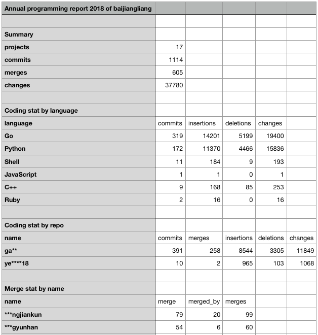
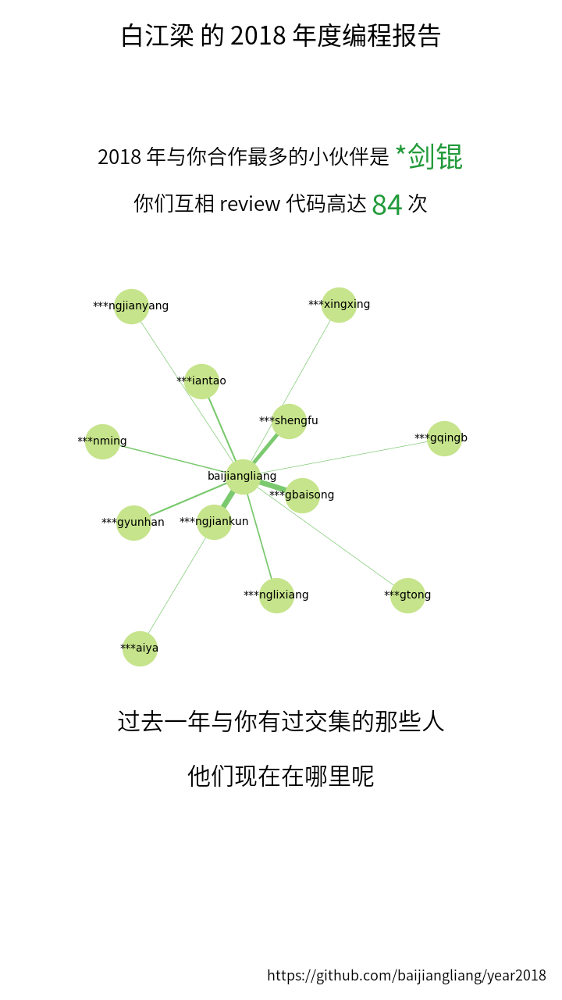

# year2018
Annual report for programmers.

## 使用
```bash
$ git clone https://github.com/baijiangliang/year2018.git
$ cd /path-to-year2018/
$ python3 main.py
```
注意：必须使用 Python3。Python3 已经发布十年了，试一下吧，它很棒。如果你的电脑上没有 Python3，你可以在 [Anaconda](https://www.anaconda.com/download/) 或者 [Python 官方网站](https://www.python.org/downloads/) 下载安装。推荐使用 Anaconda Python，它已经包含了此项目依赖的所有 Python 包。

## 依赖
项目依赖的外部包~~会自动安装~~(暂时还不支持，请安装 Anaconda Python)，如果自动安装出错，那么你可以手动安装它们。

### 必须
- [Pillow](https://pillow.readthedocs.io)
- [Matplotlib](https://matplotlib.org/)
- [NetworkX](https://networkx.github.io/)

你可以安装 Anaconda Python，或者使用命令 `$ pip3 install Pillow matplotlib networkx` 安装以上 Python 包。

### 可选
- Ruby
- Ruby gems: [github-linguist](https://github.com/github/linguist)

## 示例
- 
- 

## TODO
- Automatically install dependencies
- Use linguist to detect code files
- Beautify
- Portability
- Configurability
